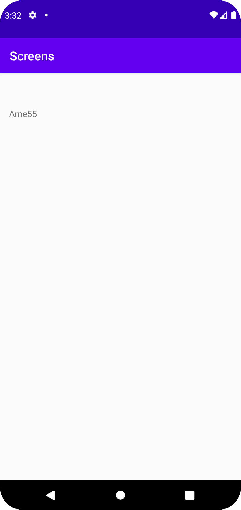

# Rapport

Först skapade jag en ny activity, efter detta så lade jag till en button i min layout. Denna knappen
kopplades då så att den öppnade den andra activityn. Sedan gjorde vi en string och en int som innehöll
datan som skickas med när man trycker på knappen. ()

    
    Knapp.setOnClickListener(new View.OnClickListener() {
    @Override
    public void onClick(View v) {
    startActivity(new Intent(MainActivity.this, MainActivity2.class));
    Bengt = new Intent(MainActivity.this, MainActivity2.class);
    Bengt.putExtra("name", "Arne"); // Optional
    Bengt.putExtra("number",  55 ); // Optional
    startActivity(Bengt);

    }});

Efter detta gjorde jag en textView som skulle visa denna datan på den andra sidan.

